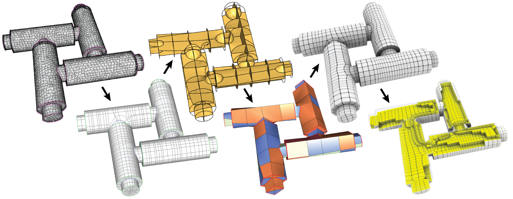

# Surface Field Driven Strongly Hex-Dominant Meshing

<p align="center"></p>

This repository contains the meshing software developed as part of the publication

**LoopyCuts: Practical Feature-Preserving Block Decomposition for Strongly Hex-Dominant Meshing**<br>
[Marco Livesu](http://pers.ge.imati.cnr.it/livesu/), 
[Nico Pietroni](http://vcg.isti.cnr.it/~pietroni/), 
[Enrico Puppo](https://www.disi.unige.it/person/PuppoE/), 
[Alla Sheffer](http://www.cs.ubc.ca/%7Esheffa/), 
[Paolo Cignoni](http://vcg.isti.cnr.it/~cignoni/)<br>
ACM Transactions on Graphics (SIGGRAPH 2020)<br>
[PDF](http://pers.ge.imati.cnr.it/livesu/papers/LPPSC20/LPPSC20.pdf)

## Step 1: Generation of cutting loops
NICO TODO

## Step 2: Cutting and Hex-dominant meshing
This part reads the refined mesh and loops generated at the previous step, and outputs a hex-dominant mesh. The software depends on [Qt](https://www.qt.io/download) for the GUI, [CinoLib](https://github.com/mlivesu/cinolib) for geometry processing, and [Tetgen](http://wias-berlin.de/software/tetgen/) for tetrahedralization. All dependencies must be prepared beforehand, and properly referred to in the project file `volumetric_cutter/volumetric_cutter.pro`. Once configured, compiling the project should as easy as opening a terminal in the same folder and typing
```
qmake .
make -j4
```
The program can be used either with a GUI, or by command line (useful to batch run entire datasets of models). 
```
./volumetric_cutter <mesh> <loops> [ -batch-mode <output_folder> ]
```
We recommend using the command line version, because it is much faster. The `scripts` folder contains a useful bash script for processing large collections of shapes with a single call.

## Output Format
Although almost entirely composed of hexahedra, our output meshes may contain arbitrary polyhedra which cannot be ecnoded in popular volumetric mesh formats such as `.mesh` and `.vtk`. All our outputs are therefore encoded using the `.hedra` format, which is structured as follows
```
nv nf np             // number of vertices, faces and polyhedra, respectively
x0 y0 z0             // xyz coordinates of the 1st point 
x1 y1 z1             // xyz coordinates of the 2nd point
...                  // 
f0 v1 v2 ... vf1     // f1: number of vertices of the 1st face, followed by the (CCW ordered) list of vertices
f1 v1 v2 ... vf2     // f2: number of vertices of the 2nd face, followed by the (CCW ordered) list of vertices
...                  //
p1  f1 -f2 ...  fp1  // p1: nuber of faces of the 1st polyhedron, followed by the list of faces
p2 -f1  f2 ... -fp2  // p2: nuber of faces of the 2nd polyhedron, followed by the list of faces
...                  // (references with negative numbers (e.g. -f) denote that face |f| is seen CW by the current poly)
```
These meshes can be visualized using [CinoLib](https://github.com/mlivesu/cinolib) (see e.g. example [#06](https://github.com/mlivesu/cinolib/tree/master/examples/06_base_app_polyhedralmesh)). Note that in case the output is a full hexahedral mesh a `.mesh` file will be also produced. Such a file can be visually inspected directly on browser connecting to [HexaLab](https://www.hexalab.net).

## Acknowldegment
If you use LoopyCuts, please consider citing the associated scientific paper using the following 
BibTeX entry:

```bibtex
@article{LoopyCuts2020,
  title   = {LoopyCuts: Practical Feature-Preserving Block Decomposition for Strongly Hex-Dominant Meshing},
  author  = {Livesu, Marco and Pietroni, Nico and Puppo, Enrico and Sheffer, Alla and Cignoni, Paolo},
  journal = {ACM Transactions on Graphics},
  year    = {2020},
  volume  = {39},
  number  = {4},
  doi     = {(10.1145/3386569.3392472)}}
```

